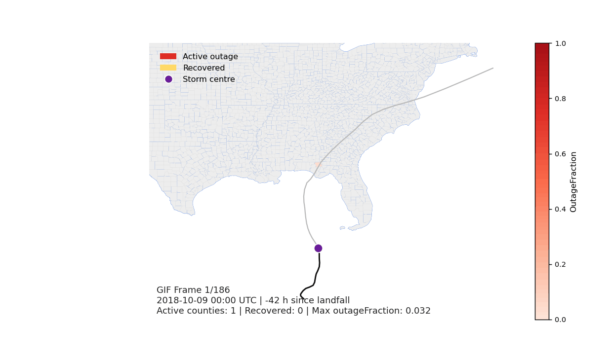

# Outage Recovery Forecasting

This project pulled together a clean CONUS outage-recovery dataset, explored storm and county patterns, and built a few baseline models and report figures. The main notebook now also saves and reuses RF/XGB tuning results instead of recomputing them every time.

That gave us a reproducible modeling workflow plus some nicer visual checks for the report. `timeseries.pq` stays in `.gitignore` because it is too large for the repo.